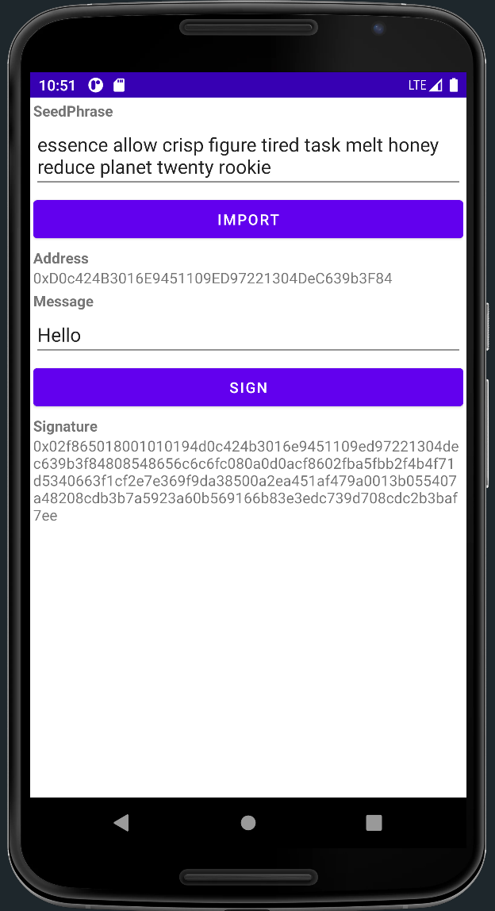

This project demonstrate how to integrate AlphaWallet into your Android application

## Quick Start
1. Open `build.gradle` under project root folder, add on the top
```
buildscript {
  dependencies {
      classpath 'com.google.dagger:hilt-android-gradle-plugin:2.40.5'
  }
}
```

2. Add dependencies in `app/build.gradle`
```
implementation 'com.alphawallet:alphawallet-library:3.58.8'
implementation "com.google.dagger:hilt-android:2.40.5"
annotationProcessor "com.google.dagger:hilt-compiler:2.40.5"
```

3. Add Gradle plugins in `app/build.gradle`
```
id 'dagger.hilt.android.plugin'
id 'realm-android'
```

4. Add blow code to `settings.gradle` -> `dependencyResolutionManagement` -> `repositories`
```
  maven { url 'https://jitpack.io' }
  maven {
      url = uri("https://maven.pkg.github.com/alphawallet/alpha-wallet-android")
      credentials {
          username = getGitHubUsername()
          password = getPAT()
      }
  }
  maven {
    url = uri("https://maven.pkg.github.com/trustwallet/wallet-core")
    credentials {
        username = getGitHubUsername()
        password = getPAT()
    }
  }
```

5. Create GitHub Personal Access Token and put into `{ProjectRoot}/gradle.properties`
```properties
# Base64 Encoded GitHub PAT,
# Make sure only check read:packages and read:user permissions if you want to create your own PAT,
# and encode it with Base64 encoder https://www.base64encoder.io/
gpr.user=Your GitHub user email
gpr.key=Your Base64 encode PAT
```

## FAQ
**Error**
```properties
attribute destination not found
```
**Solution**
Open the related layout xml file
Search below line and delete `-auto` at the end
```
xmlns:app="http://schemas.android.com/apk/res-auto"
```

**Error**
```properties
4 files found with path 'META-INF/gradle/incremental.annotation.processors'.
```
**Solution**
Add below code into `app/build.gradle` -> `android`
```
packagingOptions {
  pickFirst 'META-INF/gradle/incremental.annotation.processors'
}
```

**Error**
```properties
Duplicate class android.support.v4.app.INotificationSideChannel found in modules core-1.8.0-runtime (androidx.core:core:1.8.0) and support-compat-26.1.0-runtime (com.android.support:support-compat:26.1.0)
```
**Solution**
Ensure `{ProjectRoot}./gradle.properties` includes:
```
android.useAndroidX=true
android.enableJetifier=true
```